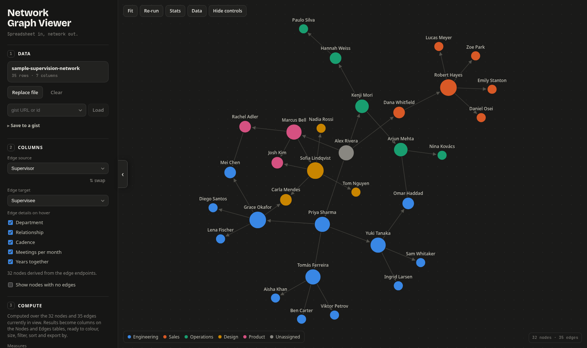

# Network Graph Viewer

> [!NOTE]
> This project is AI-generated: the code, sample data, and this README were written by [Claude Code](https://claude.com/claude-code).

Turn a spreadsheet edge list into an interactive network graph, entirely in your browser.

**Live app:** https://adamsm.com/network-graph-viewer/



## Features

### Getting data in

- Upload Excel (`.xlsx`, `.xls`, `.ods`) or CSV files; everything is parsed in memory and never leaves the browser
- Paste cells straight from Excel or Google Sheets
- Import GEXF and GraphML, including node and edge attributes and Gephi's saved positions
- Open a `#data=…` link and the graph it carries is already there; nothing is fetched
- Load from a public GitHub gist by URL or id, or share a `?gist=…` link that opens straight into the graph
- A workbook with several sheets can use one as the edges and another as node attributes

### Shaping the graph

- Pick which columns are the edge source and target and which show up as edge details
- Nodes are first-class: they keep their own attributes and can exist without any edges
- A data table over both the node and edge tables: search, sort, group with count/sum/average/min/max, hide columns, add and delete rows, and edit any cell with the graph updating as you type

### Styling

- Colour nodes by a column or a network metric, size them by degree or any number column, and colour and weight the edges the same way
- Four categorical palettes, including the published colourblind-safe Okabe-Ito and Tol bright sets, and four ramps for numeric rankings
- Or build your own: edit any slot, add and remove colours, and the palette travels with the workspace, the export and the shared link
- Node images from a column of `https` links, data URIs, bare base64, or SVG markup: the picture fills the node and its colour becomes the ring, so an image costs nothing the colours were saying. The shipped **Web toolchain** sample is 42 projects wearing their logos, and the one place the app fetches anything from a third party

### Filters that chain

Filters apply in order, each one seeing the subgraph the last produced, so
`two steps out from Alex` followed by `degree ≥ 2` measures degree _inside that
neighbourhood_. Reordering the same two steps asks a different question.

- Column values on either the nodes or the edges
- Degree range, k-core, largest components, ego networks, reciprocated edges only
- Disparity backbone: keep only the edges carrying more weight than their endpoints' other edges can explain

### Measures

Computed on demand and written back as ordinary columns, so every result can
immediately drive colour and size, be filtered on, sorted in the table, and
travel into an export.

- Degree, in-degree, out-degree, PageRank, HITS hub and authority, betweenness, closeness, harmonic closeness, eigenvector
- Louvain modularity classes, with a resolution control; deterministic, so a rerun gives the same communities
- k-core, triangle counts, connected components
- Edge measures: shared neighbours, Simmelian strength, disparity-filter significance
- Whole-graph metrics with plain-language explanations: density, diameter, average path length, clustering

### Layouts

Eight layouts that morph into one another rather than jumping:

- **ForceAtlas2** with repulsion, gravity, LinLog and edge-weight controls, Barnes-Hut accelerated
- **Force**, **hierarchy**, **radial**, **circle**, **grid**
- **Circle pack**, one disc per group
- **Scripted**, positions from your own code
- Plus an anti-overlap force and a one-shot Noverlap pass

### Writing your own

Metrics and layouts you write yourself, run in [QuickJS](https://bellard.org/quickjs/)
compiled to WebAssembly inside a Web Worker. A script gets a 3 second deadline,
a 64 MB ceiling, seeded randomness, and an empty global scope with no network
access.

### Getting data out

- SVG and PNG of the current view
- GEXF including positions and colours, so Gephi opens it looking like it did here
- GraphML with typed attribute keys
- A `.ngv.json` workspace holding everything: both tables, the filter chain, styling, layout and node positions
- CSV of the edge table
- A link with the whole workspace deflated into its fragment, so sharing the graph is sharing a URL and the data still never reaches a server
- Save any of it to a GitHub gist with a personal access token, which puts the gist's id in the address bar for a link that stays short whatever the graph weighs

## Development

```sh
pnpm install
pnpm dev          # start the dev server
pnpm build        # type-check and build to dist/
pnpm lint         # oxlint
pnpm test         # vitest
pnpm format       # oxfmt
```

## Stack

- [Vite](https://vite.dev/) + [React 19](https://react.dev/) + TypeScript
- [d3-force](https://d3js.org/d3-force), d3-zoom, d3-drag and d3-quadtree for simulation and interaction
- [SheetJS](https://sheetjs.com/) for Excel and CSV parsing
- [TanStack Table](https://tanstack.com/table) and [TanStack Virtual](https://tanstack.com/virtual) for the data grid
- [quickjs-emscripten](https://github.com/justjake/quickjs-emscripten) for the script sandbox
- GEXF and GraphML are read and written with the platform's own `DOMParser`
- Deployed with GitHub Pages
